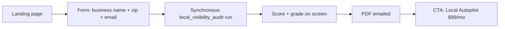

# Customer onboarding

> What end users see and do after signup. Tiered by SKU. Use this as the
> spec for the dashboard onboarding flows we'll build, the help-center
> articles we'll write, and the support scripts.

Tiers and pricing live in [`pricing.md`](pricing.md). Distribution motion
in [`distribution.md`](distribution.md).

---

## North-star outcomes

A new Nemo customer is "onboarded" when **both** of these are true:

1. **First value delivered**: at least one finished job has produced a
   deliverable (PDF in inbox, draft in dashboard, or extension insight on
   a real account).
2. **Recurring jobs scheduled**: at least one schedule is enabled so the
   product produces value next week without the user logging in.

Time-to-onboarded targets:

| Tier | Target | Hard ceiling |
|---|---|---|
| Wedge → Local Autopilot | < 10 min | 24 hours |
| Wedge → Growth Operator | < 20 min | 48 hours |
| Agency | < 60 min (per first client) | 1 week |

If a customer is past the ceiling without finishing, support reaches out.

---

## 0. Wedge (anyone, free)

This is the on-ramp. No login. Lives at `nemo.local/`.

What the wedge does (mapped to code):

- Submits to [`POST /api/lvs`](../nemo-saas/app/api/lvs/route.ts)
- Inserts into `leads` table immediately so we never lose an email
- Runs [`local_visibility_audit`](../nemo-saas/lib/skills/local_visibility_audit/index.ts)
  with narrative on
- Renders PDF via [`lib/pdf/lvs-report.tsx`](../nemo-saas/lib/pdf/lvs-report.tsx)
- Emails via Resend ([`lib/email/lvs.tsx`](../nemo-saas/lib/email/lvs.tsx))
- Returns `reportUrl` for instant display
- **Follow-up loop** ([`lib/lead-followup.ts`](../nemo-saas/lib/lead-followup.ts)):
  - Internal alert to `LVS_INTERNAL_NOTIFY_EMAIL`
  - Sync to outbound CRM via Hunter webhook (`source=lvs_wedge`, `external_id=lvs:{leadId}`)
  - 48h nurture email via Inngest if `promoted_org_id` is still null

What support says when it breaks:

- *"PDF didn't arrive"* → check `leads` row exists, check `artifacts` row
  exists, resend manually using the public URL.
- *"Score is wrong"* → fixture issue, file a bug. Score is deterministic;
  same input = same output.
- *"Wrong business pulled up"* → Google Places match was ambiguous; we
  show the address in the PDF so the user can flag it.

---

## 1. Local Autopilot ($99/mo solo · $199/mo crew) — home services

ICP: landscapers, handymen, HVAC, plumbers, residential cleaners, pest
control, electricians, roofers, painters.

### 1a. Activation flow (target: < 10 min)

1. **Sign up** with email + password (Supabase auth).
2. **Org auto-created**: name = business name from the wedge if available,
   otherwise email-prefix; `plan = local_autopilot` after Stripe checkout.
3. **Connect Google Business Profile** — OAuth via
   [`/api/oauth/google/callback`](../nemo-saas/app/api/oauth/google/callback/route.ts)
   with the `business.manage` scope. Required.
4. **Confirm site profile**: business name, address, phone, primary
   category, service-area zips. Pre-filled from GBP wherever possible.
5. **Generate `CLIENT.md`**: create the starter intelligence file from the
   business profile, wedge audit, initial goals, constraints, and open
   hypotheses. Unknowns become **Open Questions**, never invented facts. This
   writes `client_intelligence_files` and the first
   `client_intelligence_events` row.
6. **Auto-enable starter schedules** (server-side, plan-gated):
   - `local_visibility_audit` — weekly
   - `reputation_loop` — weekly
   - `ga4_health_brief` — monthly (only if user connects GA4 in step 6)
   - `local_landing_builder` — monthly (skipped until website URL is set)
7. **Optional**: connect GA4 (skipped without slowing onboarding).
8. **First report runs immediately**: same flow as the wedge but with the
   GBP-managed (not Places-only) signals. Email sent within 3 min.

### 1b. The "we're working" reassurance loop

Solo home-services owners churn fast if they don't see the product working
between logins. We send:

- **Weekly SMS** (opt-in during signup): "Nemo fixed 3 listings and
  asked 4 customers for reviews this week. View report ↗"
- **Monday client brief**: two paragraphs max — what changed/worked, what we
  test next — generated from `CLIENT.md` + recent jobs.
- **Monthly email**: full PDF, narrative + actions taken
- **In-app banner** on next login: "Since you were last here: …"

The SMS is the magic. It tells the user the product is alive without
asking them to do anything.

### 1c. Reputation Loop (the highest-value Local Autopilot piece)

After every job their CRM marks complete (Jobber, Housecall Pro,
ServiceTitan integration — see [`distribution.md`](distribution.md)):

1. We send the customer an SMS with a friendly review-request link.
2. We pre-fill the rating prompt to drop the user straight onto Google.
3. New review detected → next weekly LVS audit reflects the bump.

If no integration is connected, the user can paste a job-completion list
manually or trigger one-off review requests from the dashboard.

### 1d. Cancel + win-back

- Customer hits Stripe portal → subscription cancels at period end.
- Webhook ([`/api/stripe/webhook`](../nemo-saas/app/api/stripe/webhook/route.ts))
  sets `orgs.plan = 'free'`, schedules disable.
- We send a "we'll keep your reports forever" goodbye email.
- 30-day re-engagement: free LVS rerun + their score delta since signup.

---

## 2. Growth Operator ($299–$799/mo) — growing online businesses

ICP: e-com, SaaS, info-product, local chains.

### 2a. Activation flow (target: < 20 min)

1. **Sign up + checkout**.
2. **Connect Google Search Console**:
   - Required. OAuth `webmasters.readonly` scope.
   - User picks one verified property per site.
3. **Connect Google Analytics 4**:
   - Strongly encouraged. OAuth `analytics.readonly` scope.
   - User picks one GA4 property per site.
4. **Set "primary money page"** per site (e.g. `/pricing`, `/checkout`):
   the reporter weights conversion-path insights toward this page.
5. **Pick reporting cadence** (defaults to weekly GSC + monthly GA4).
6. **Install the Chrome extension** (one-click pair):
   - Pairing flow opens `/extension/pair` in a new tab.
   - User clicks "Authorize", which mints a 90-day extension token bound
     to their org.
   - Extension stores the token via `chrome.runtime.sendMessage` (see
     [`extension/popup.js`](../nemo-saas/extension/popup.js)).
7. **First GSC opportunity report runs immediately**: shows top 10 pages
   stuck in positions 4–15 with title/H1 rewrites.

### 2b. The "weekly digest" loop

Every Monday morning at the customer's local 8 AM:

- `gsc_opportunity_finder` runs against the prior 90 days
- `paid_qa` runs (if Google Ads connected)
- Reporter composes a single email with:
  - Top 3 query-page opportunities (with rewrite drafts)
  - Top 1 paid waste alert (if any)
  - Link to the full dashboard

### 2c. Chrome extension UX (in-flow value)

When the user is in `analytics.google.com` or
`search.google.com/search-console`:

- A small "NEMO" chip in the corner of the page (see
  [`extension/content.js`](../nemo-saas/extension/content.js))
- Clicking opens the popup → up to 5 contextual insights for that property
- Each insight has a stable `id` matching server-side rules; clicking
  "Open in dashboard" deep-links to a workflow run that turns it into a
  scheduled task

The extension never reads page DOM for analytics data — everything flows
through the OAuth-authorized API calls server-side. This is documented in
[`extension/README.md`](../nemo-saas/extension/README.md).

### 2d. Multi-site upgrades

Default Growth Operator includes 1 site. The dashboard offers in-line
upgrades to 3 sites ($599/mo) and 5 sites ($799/mo). Adding a site:

1. Opens "Connect site" wizard.
2. Same connector flow (GSC + optional GA4).
3. Schedules auto-clone from the first site's defaults.

---

## 3. Agency tier ($499/mo per seat OR $1,999/mo for 25 client locations) — phase 3

Not built at launch. When it ships, the activation differs:

### 3a. Workspace setup

1. Agency owner creates the workspace; invites analyst seats.
2. Analyst seats have role `member`; owner has `owner`. Roles in
   [`org_members`](../nemo-saas/supabase/migrations/20260429000000_init.sql).
3. Each "client" becomes a `Site` under the agency `Org`. Connectors
   attach per site.

### 3b. White-label branding

- Agency uploads logo + sets brand color.
- PDF templates render with the agency's branding (the renderer in
  [`lib/pdf/lvs-report.tsx`](../nemo-saas/lib/pdf/lvs-report.tsx) gets a
  branding parameter when the agency tier ships).
- "From" email becomes `reports@<agency-domain>` via Resend domain.

### 3c. Bulk operations

- Apply a schedule to all client sites at once.
- Export client roll-up CSV (one row per site, one column per skill score).
- REST API: `GET /api/v1/orgs/<id>/sites`, `POST /api/v1/sites/<id>/jobs`,
  etc. (Spec to be written before phase 3 ships.)

### 3d. Agency support SLA

Paid agency tier includes:

- Dedicated Slack channel
- 1 onboarding call
- Quarterly business review
- 24-hour first-response on tickets

---

## 4. Common onboarding choreography (across tiers)

### 4a. Empty state philosophy

Every dashboard page that could be empty must show:

1. **What this is** (one sentence)
2. **Why you'd want it** (one sentence, dollars-and-jobs framed)
3. **The single next action** (button + link)

No empty plates with "no data yet."

### 4b. Connector failure modes

When an OAuth token is revoked or expires, the affected `Connector` row
flips to `status='expired'`. Behavior:

- Inngest workflow attempts to refresh — if 401, sets `status='revoked'`.
- Dashboard surfaces a banner: "Reconnect Google Search Console to keep
  your weekly reports running."
- Email digests still send the deterministic part; narrative reduces to
  "we're missing data for the last week — reconnect to fix."

### 4c. Data residency + deletion

- Customer-facing copy: "Your GSC, GA4, and GBP data stays in Supabase US.
  We never train on it. Cancel and your data is removed within 30 days."
- Implementation: `delete from orgs where id = …` cascades through every
  child table (RLS + ON DELETE CASCADE) and Supabase Storage cleanup runs
  daily for orphaned bucket paths.

### 4d. Receipts and renewals

- Stripe customer portal handles invoices + card updates.
- We don't build a custom billing UI; just deep-link to the portal from
  `/app/billing`.

---

## 5. Onboarding analytics (what we measure)

Every onboarding step emits a `analytics_events` event (table to be
added). At minimum:

| Event | Fired when | Used for |
|---|---|---|
| `wedge_submitted` | LVS form submit | Top of funnel |
| `wedge_pdf_opened` | tracking pixel in PDF | Email engagement |
| `signup_completed` | Supabase auth user created | Conversion |
| `connector_added` | OAuth callback success | Activation step counter |
| `first_job_succeeded` | First non-wedge job finishes | "First value" milestone |
| `schedule_enabled` | First recurring schedule turned on | "Onboarded" milestone |
| `extension_paired` | Extension token first stored | Growth Operator activation |
| `cancellation_started` | Stripe portal cancel click | Churn early-warning |

Funnel chart (target):

- Wedge submitted → Signup: 8%
- Signup → Connector added: 80%
- Connector added → First job succeeded: 95%
- First job succeeded → Schedule enabled: 90%
- Onboarded customer → Active 30 days later: 75%

If any step drops more than 10pp week-over-week, that's the next thing
to fix — not the next feature.

---

## 6. Help center starter outline

These articles need to exist before a paying customer's first support
ticket. Linked from the dashboard's `?` icon.

### Wedge

- "What is the Local Visibility Score?"
- "Why does my report show 'we couldn't find your business'?"

### Local Autopilot

- "Connecting your Google Business Profile"
- "How review-request SMS works"
- "What's in my weekly report"
- "Disconnecting and exporting your data"

### Growth Operator

- "Connecting Search Console + Analytics"
- "Installing the Chrome extension"
- "Reading the GSC opportunity report"
- "Why is the extension empty on this page?"

### Agency (phase 3)

- "Adding a client location"
- "White-labeling reports"
- "Using the REST API"

Each article: ≤ 250 words, one screenshot, one "next step" link. Don't
write a manual; write enough to unblock the next click.
